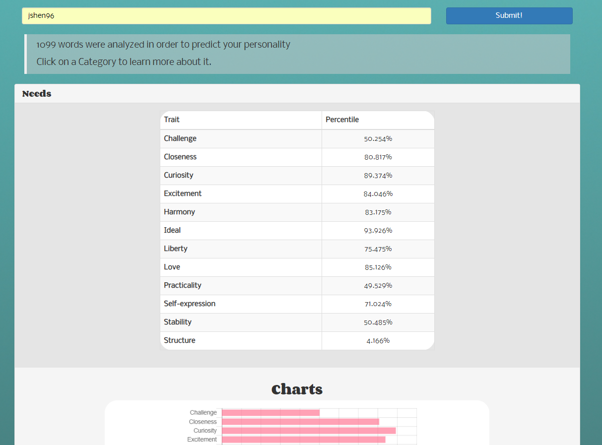
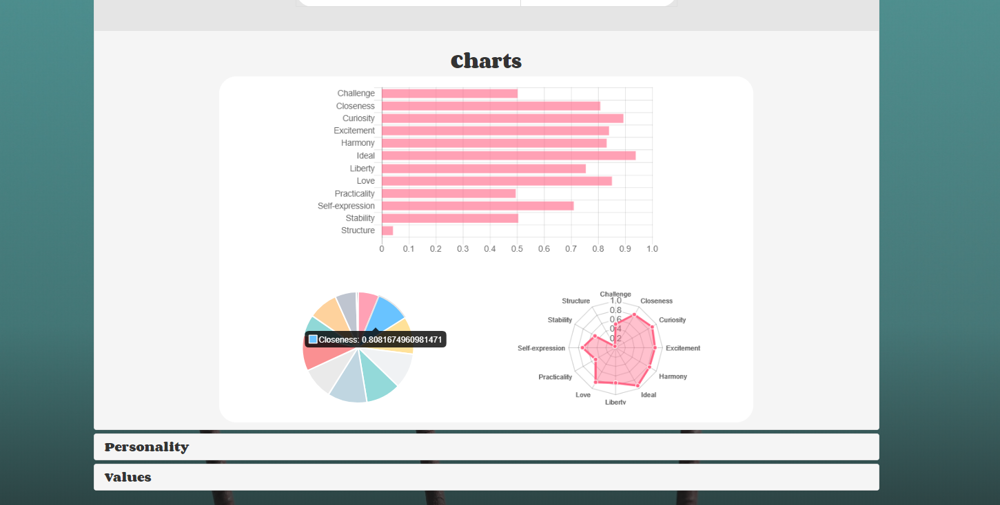

# Twitter-Personality

Single Page Application that predicts a user’s personality based on his/her twitter feed using a Machine Learning Model.

### How this works
This app is built using Express & Node as the REST backend that handles HTTP calls from the front-end, built using Angular.
<ol>
  <li>
A user would provide a twitter screen name submits it via the angular front end. </li>
   <li>The angular application would then make a GET call to the "./personality" endpoint, passing in the provided twitter username as a parameter.
</li>
   <li>The backend would then extract the parameter, and use the Twit API to extract tweets from the user's twitter profile. Then, it would pass those tweets as Strings into IBM Watson's personality insight API. THe response from IBM watson will be a JSON format that contains personality predictions made from the tweets. </li>
   <li>The JSON object is then passed back to the front end. The angular app now parses these JSON object and extracts relevant information to visualize the data in a user friendly format.</li>
</ol>

### Prerequisites

You will need Node.js, NPM, and angular installed

### Installing

run <code>npm start</code> in twitter directory
run <code>ng serve --open</code> in who-are-you directory

### Demo
Type in an existing twitter screen name and see your personality visualized right in front of you!  
Click on the tab to learn more about that category  

## Built With

*node.js
*npm
*angular
*Twit
*IBM Watson

